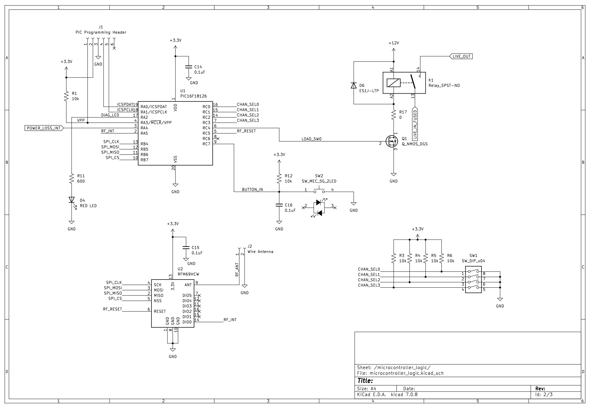
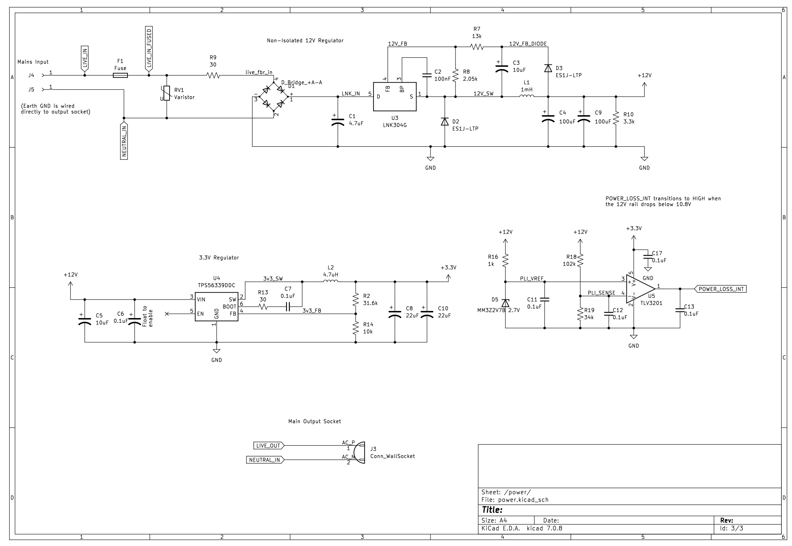
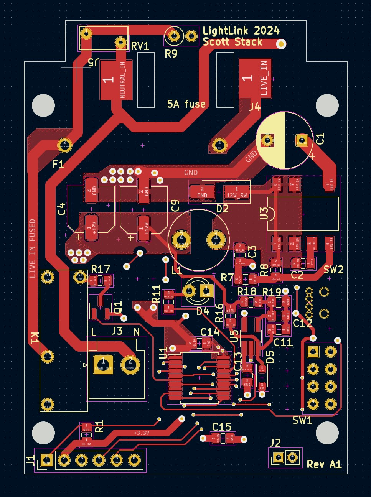
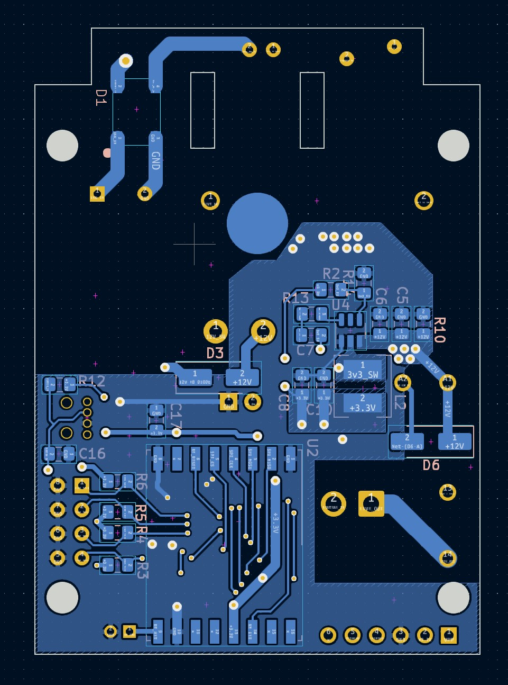

# Light Link

A way to remotely link power outlets! This is an idea taken from the "Switcheroo" device that allows taking an existing switched 
power outlet and linking it wirelessly with another outlet. 

Basically, you can change the location of an outlet that is already hooked up to a switch. The device uses a simple 915MHz wireless
transceiver so there's no wifi/bluetooth involved. You just select the channel you want to control and if any device on 
that channel is powered on or off, all of the devices on that channel will follow it.

It's really useful for me in an apartment where you can't change the wiring (or just don't want to). I made about 10 of these devices to
use in multiple locations where there's a switched outlet.

|                 |                    | 
|-----------------|--------------------|
| |  |

## Board Design

The board was designed in KiCAD and manufactured by JLC PCB. The main components are a PIC microcontroller connected to an RFM69HCW
wireless transciever. There's also a relay connected to the live end of the incoming mains voltage and a small set of DIP switches for
selecting which channel to transmit on.

The power system is somewhat interesting. A 12V rail is generated through a simple switching regulator that's designed to replace 
capacitive dropper circuits (small amount of current). This rail contains some very large electrolytic capacitors that serve to store energy
and power the rest of the system for a small amount of time when mains voltage is lost. This 12V rail feeds into a second DC-DC switching regulator that powers
the digital electronics. If the 12V rail drops below a threshold, a signal is sent to the PIC to transmit the "power down" command
to all other LightLinks on it's channel.

Schematic Sheet 1 | Schematic Sheet 2 
|-----------------|--------------------|
||  |

Board Layout Front | Board Layout Back 
|-----------------|--------------------|
| |  |

