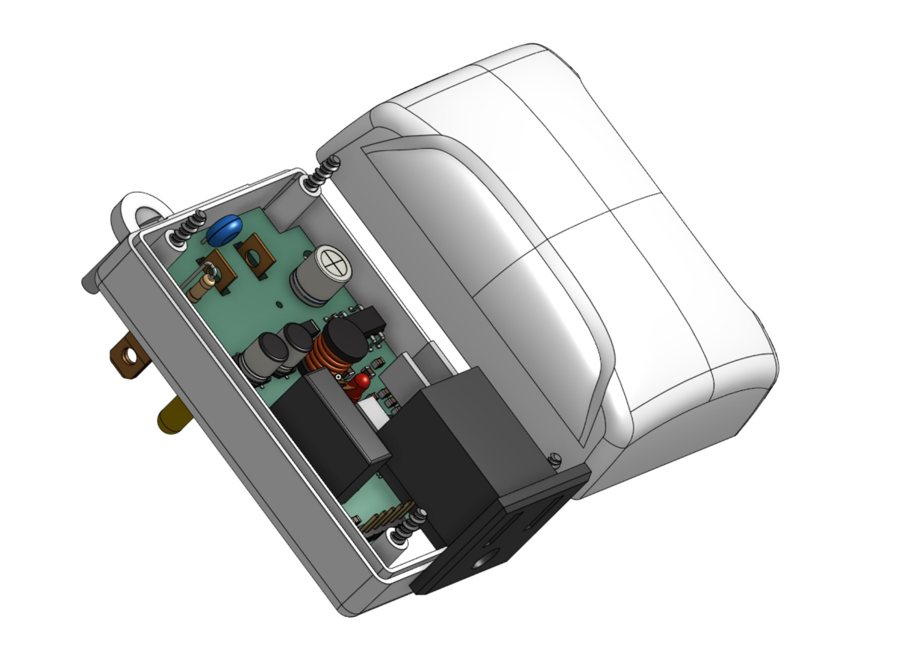

# Light Link

A way to remotely link power outlets! This is an idea taken from the "Switcheroo" device that allows taking an existing switched 
power outlet and linking it wirelessly with another outlet. 

Basically, you can change the location of an outlet that is already hooked up to a switch. The device uses a simple 915MHz wireless
transceiver so there's no wifi/bluetooth involved. You just select the channel you want to control and if any device on 
that channel is powered on or off, all of the devices on that channel will follow it.

